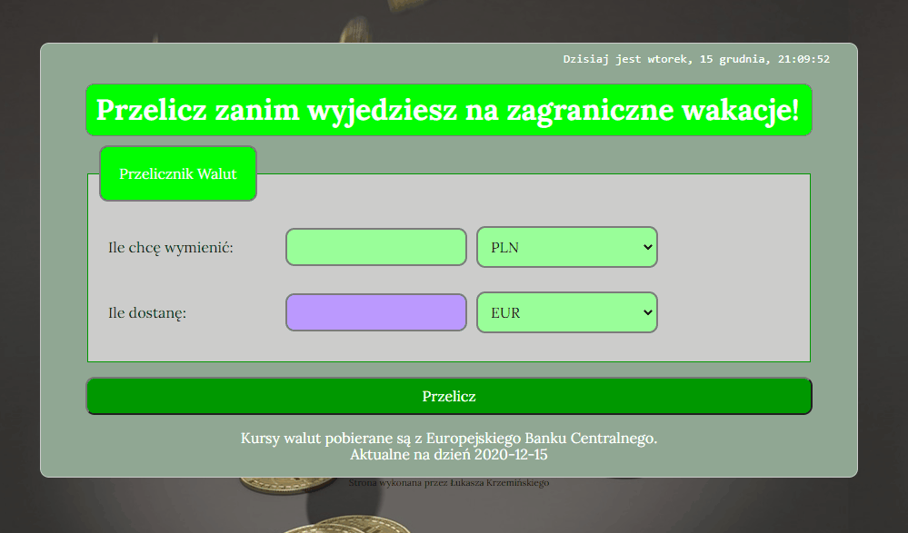

  
*Click the image above to see demo*

# Simple Currency Converter

## I've made a simple currency converter. It allows you to convert one currency into another. This time the whole app was created in React!

### Description
The currency-converter is a simple page where I practiced JS Functions. You can chose one of available currencies and convert it into another one. The exchange rates are fetched from API using European Central Bank rates. This project show my previous currency-converter but this time I used React.

### How it works

1. Chose the amount of money u want to convert
2. Chose the currency u currently have
3. Chose the currency u want to get
4. Click the "Przelicz!" ("convert") button
5. In the violet window u can see the amount of money in chosen currency that you will get

### Preview

### Technologies Used

- HTML
- CSS
- JS
- BEM
- React
- Styled Components
- Custom hooks
- fetch API

### Added features

 - added clock which displays current date and time
 - exchange rates used from https://exchangerate.host/

### Author
Łukasz Krzemiński

### Contact
contact me at: [krzeminski.lukasz@interia.pl](krzeminski.lukasz@interia.pl)

This project was bootstrapped with [Create React App](https://github.com/facebook/create-react-app).

## Available Scripts

In the project directory, you can run:

### `npm start`

Runs the app in the development mode. 
Open [http://localhost:3000](http://localhost:3000) to view it in the browser.

The page will reload if you make edits. 
You will also see any lint errors in the console.

### `npm run build`

Builds the app for production to the `build` folder. 
It correctly bundles React in production mode and optimizes the build for the best performance.

The build is minified and the filenames include the hashes. 
Your app is ready to be deployed!

See the section about [deployment](https://facebook.github.io/create-react-app/docs/deployment) for more information.

### `npm run eject`

**Note: this is a one-way operation. Once you `eject`, you can’t go back!**

If you aren’t satisfied with the build tool and configuration choices, you can `eject` at any time. This command will remove the single build dependency from your project.

Instead, it will copy all the configuration files and the transitive dependencies (webpack, Babel, ESLint, etc) right into your project so you have full control over them. All of the commands except `eject` will still work, but they will point to the copied scripts so you can tweak them. At this point you’re on your own.

You don’t have to ever use `eject`. The curated feature set is suitable for small and middle deployments, and you shouldn’t feel obligated to use this feature. However we understand that this tool wouldn’t be useful if you couldn’t customize it when you are ready for it.
